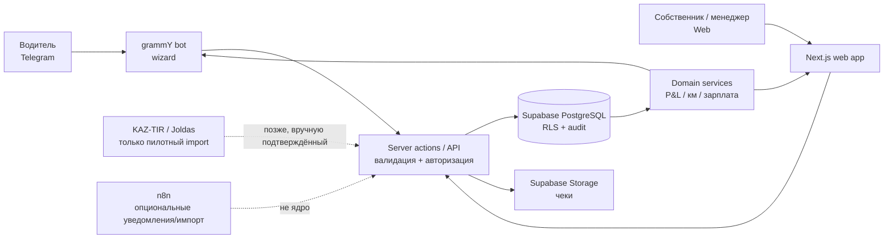

# Архитектура MVP

## Принцип

Один TypeScript-кодbase, модульный монолит. Не строим микросервисы. Источник истины — PostgreSQL в Supabase; Google Sheets и n8n не являются ядром финансовой модели.

## Слои

| Слой | Ответственность | Не делает |
|---|---|---|
| Next.js Web | dashboard, справочники, рейсы, review | расчёты только в UI |
| Telegram bot | короткие wizard-диалоги водителя | прямой доступ к БД и финансовое подтверждение |
| Domain package | P&L, км, fuel KPI, salary rules, validation | HTTP, Telegram, SQL-транспорт |
| Supabase | PostgreSQL, Auth, Storage, RLS | бизнес-логику интерфейса |
| n8n | уведомления, разовые импорты, интеграционные retry | основную модель продукта и conversation state |

## Основные потоки

### Расход от водителя

1. Driver выбирает «Добавить расход».
2. Bot проверяет его `telegram_user_id`, роль `DRIVER` и активное назначение на рейс.
3. Wizard получает категорию, сумму, валюту; для топлива — литры и одометр; опционально фото и геолокацию.
4. API создаёт `expense` со статусом учёта `RECORDED`, но с финансовым review-статусом `PENDING`, источником, автором и audit event.
5. Domain service пересчитывает read-model рейса/машины; bot возвращает подтверждение без внутренней маржи всей компании.

### Рейс и P&L

1. Owner/Manager создаёт `trip` и один или несколько `trip_leg`.
2. Доход и расходы привязываются к рейсу или плечу; общий расход может оставаться на уровне машины/организации.
3. После closing review создаётся неизменяемый вычисляемый P&L snapshot: revenue, variable expenses, driver pay, estimated tax, profit, cost/km, profit/km, loaded/empty km. В расчёт входят только `APPROVED` расходы.
4. Любая корректировка сохраняет автора, время, источник и причину; удаление финансовых фактов — soft delete.

## Доступ и конфиденциальность

- Все бизнес-таблицы несут `organization_id`.
- RLS использует membership текущего пользователя; Telegram-запись проходит через проверенный server-side service, не через прямой SQL из бота.
- `OWNER` видит организацию; `MANAGER` — операционные записи в рамках разрешений; `DRIVER` — только свои назначения, рейсы и расчёт зарплаты.
- Реквизиты, документы личности, банковские секреты и внутренняя маржа организации не отправляются в Telegram.

## Надёжность

- Telegram update хранит внешний id и обрабатывается идемпотентно.
- Вложения сначала получают storage key, затем связаны с расходом транзакционно.
- Ошибки интеграции попадают в exception log с безопасным summary; повтор использует исходный idempotency key.
- Денежные операции и зарплата не утверждаются AI или фоновым workflow.
