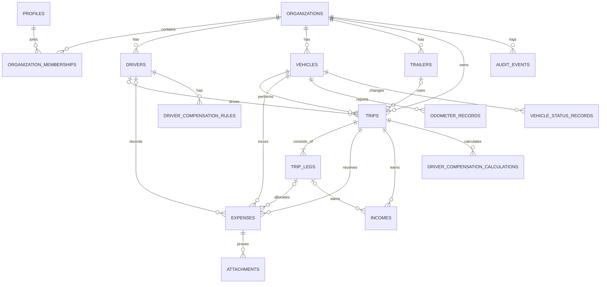

# Модель данных MVP

## Границы tenant-а

`organization` — верхняя граница данных. Каждая деловая сущность, включая справочники, финансовые записи, файлы и audit, привязана к `organization_id`. Global/system справочники не содержат данных клиента.

## Сущности

| Сущность | Назначение |
|---|---|
| `organizations` | транспортная компания и её валюта/часовой пояс |
| `profiles`, `organization_memberships` | пользователь и роль в tenant-е |
| `drivers` | водитель, Telegram ID и статус |
| `vehicles`, `trailers` | машина и прицеп, статусы и параметры |
| `trips` | управленческий рейс, владелец, статус, даты |
| `trip_legs` | плечи рейса; отдельно loaded/empty и одометры |
| `expense_categories`, `expenses` | системные и кастомные категории, факт расхода |
| `incomes` | доход по рейсу или плечу, ожидаемая/фактическая оплата |
| `odometer_records` | независимые показания пробега и их источник |
| `vehicle_status_records` | статусы движения, loaded/empty, локация |
| `driver_compensation_rules`, `driver_compensation_calculations` | настраиваемое правило и результат расчёта |
| `tax_profiles` | параметры управленческой налоговой оценки |
| `maintenance_records` | минимальный учёт ТО/ремонта, без склада |
| `attachments` | метаданные чека в Storage, не binary в БД |
| `audit_events` | неизменяемый журнал действий |

## Ключевое правило TripLeg

`trip` не равен одной загрузке и одной выгрузке. Он объединяет несколько плеч, например: Алматы → Екатеринбург → Москва → Костанай. У каждого `trip_leg` есть origin, destination, даты, `start_odometer`, `end_odometer`, `distance_km`, `load_state`, cargo и опциональный доход.

## ER-диаграмма

## Финансовые определения

| Показатель | Формула / правило |
|---|---|
| Total km | сумма `trip_leg.distance_km`; при подтверждённых одометрах сверяется с разницей пробега |
| Empty km | сумма плеч с `load_state=EMPTY` |
| Empty % | `empty_km / total_km * 100`; только при `total_km > 0` |
| Revenue | сумма active `income.amount_base` рейса и плеч |
| Variable expenses | расходы категорий Fuel, Toll, Parking, Daily allowance и т.п. |
| Fuel L/100 km | `fuel_liters / fuel_distance_km * 100`; не считать при нулевом пробеге |
| Cost/km | управленческие расходы рейса / total km |
| Profit/km | P&L profit / total km |
| Operating profit | revenue − variable expenses − driver compensation − estimated tax − включённые распределённые расходы |

Деньги, начисленная прибыль и банковская оплата — разные факты. `income.expected_payment_at`, `payment_status` и `paid_at` не должны подменять `revenue`.

## Инварианты и аудит

- amount/quantity положительны; валюты ISO 4217; даты в UTC плюс timezone организации.
- Литры, price per unit и сумма топлива проверяются с допустимым округлением.
- Нельзя закрыть рейс без хотя бы одного плеча и итоговых километров.
- Нельзя записать expense/income в чужую организацию или к машине из другого tenant-а.
- Финансовые факты не удаляются физически: `deleted_at`, `deleted_by`, reason и audit event.
- P&L — вычисляемый read-model; исходные `income`, `expenses`, kilometrage и правила остаются первичными фактами.

